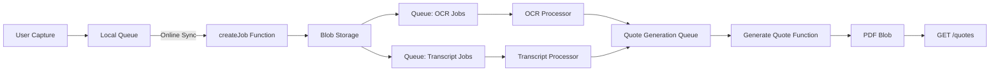

# Data Flow

```mermaid
flowchart LR
A[User Capture] --> B[Local Queue]
B -->|Online Sync| C[createJob Function]
C --> D[Blob Storage]
D --> E[Queue: OCR Jobs]
D --> F[Queue: Transcript Jobs]
E --> G[OCR Processor]
F --> H[Transcript Processor]
G --> I[Quote Generation Queue]
H --> I
I --> J[Generate Quote Function]
J --> K[PDF Blob]
K --> L[GET /quotes]
```

## Notes

- Each stage can fail independently; add retry policies.
- Enhance with correlation IDs for tracing.